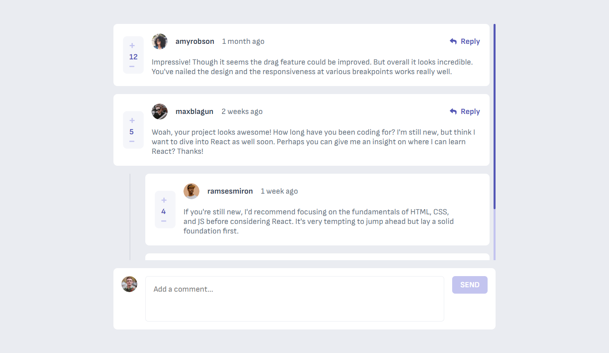

# Commenting Connoisseur 💬

## Overview

Commenting Connoisseur is an interactive, feature-rich comments section web application built with React. It provides a seamless user experience for managing comments and replies with full CRUD (Create, Read, Update, Delete) functionality.

## 🖼️ Screenshot



_A full view of the interactive comments section showing comments, replies, and user interactions_

## 🌟 Features

- **Interactive Comments**: Add, edit, delete comments and replies
- **Voting System**: Upvote and downvote comments
- **Responsive Design**: Fully responsive across all device sizes
- **Accessible**: Follows web accessibility guidelines
- **Persistent Storage**: Uses localStorage to save user interactions
- **Toast Notifications**: Provides feedback for user actions

## 🛠 Tech Stack

- **Frontend**: React.js
- **Styling**: CSS (with CSS Variables)
- **State Management**: React Context API
- **Notifications**: React Toastify
- **Build Tool**: Vite
- **Linting**: ESLint

## 🎨 Styling

- Fully customizable via CSS variables
- Responsive design
- Accessible color contrasts
- Custom scrollbar
- Text selection styling

## 🚀 Getting Started

### Prerequisites

- Node.js (v18+)
- npm or yarn

### Installation

1. Clone the repository

```bash
git clone https://github.com/KeepSerene/interactive-comments-section-fem.git
```

2. Install dependencies

```bash
npm install
```

3. Run the development server

```bash
npm run dev
```

## 🔮 Future Updates

- [ ] Backend integration
- [ ] User authentication
- [ ] Database storage (MongoDB/Firebase)
- [ ] Real-time commenting
- [ ] Enhanced moderation tools
- [ ] Social media sharing of comments

## 👤 Author

**Dhrubajyoti Bhattacharjee**

- GitHub: [@KeepSerene](https://github.com/KeepSerene)
- Portfolio: [Dhrubajyoti Bhattacharjee](https://math-to-dev.vercel.app/)
- LinkedIn: [Dhrubajyoti Bhattacharjee](https://linkedin.com/in/yourusername)

## 🌐 Live Demo

[View Live Demo](https://commenting-connoisseur.vercel.app/)

## 📄 License

This project is open source and available under the [MIT License](LICENSE).

## 🙏 Acknowledgements

- [React](https://reactjs.org/)
- [Vite](https://vitejs.dev/)
- [React Toastify](https://fkhadra.github.io/react-toastify/)
- Frontend Mentor for the challenge inspiration
